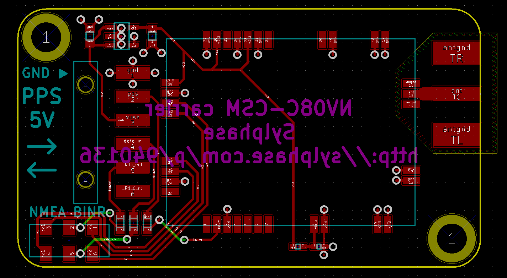
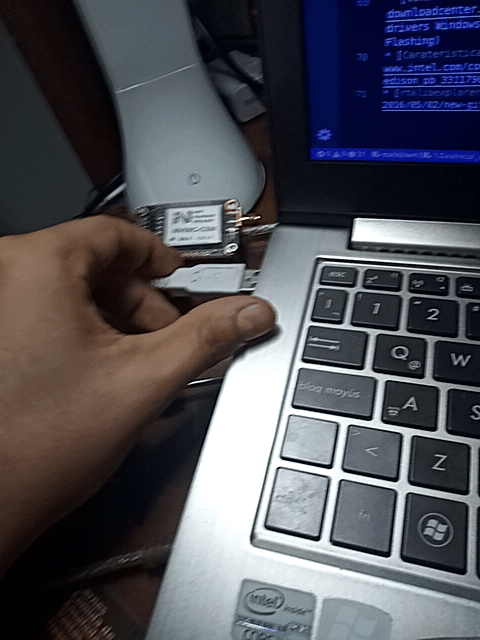
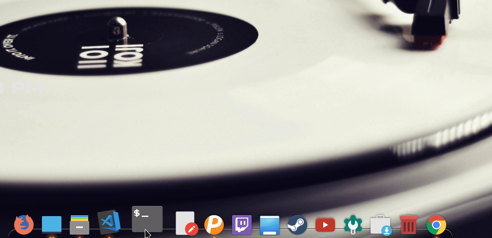
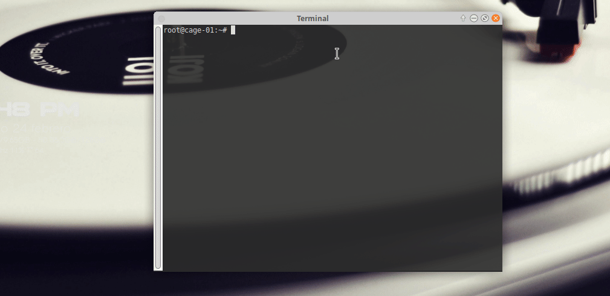
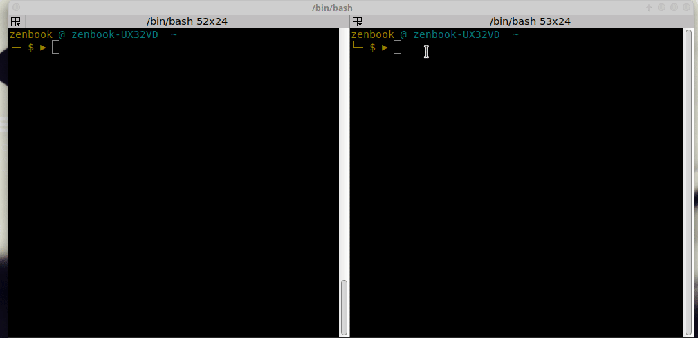
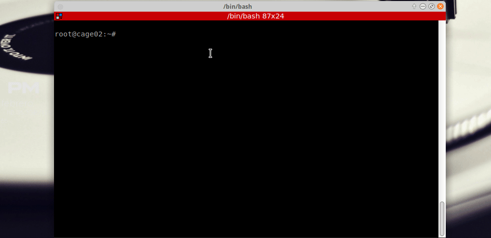

# Tabla de contenido
<!-- TOC -->
- [Tabla de contenido](#tabla-de-contenido)
- [Conociendo y reconociendo los módulos](#conociendo-y-reconociendo-los-m%C3%B3dulos)
  - [Intel Edison](#intel-edison)
  - [Base Block Spark Fun](#base-block-spark-fun)
  - [UART Block Spark Fun](#uart-block-spark-fun)
  - [Receptor NVS-08C](#receptor-nvs-08c)
    - [Versión v4.1 (1214)](#versi%C3%B3n-v41-1214)
    - [Versión v4.1 (1213)](#versi%C3%B3n-v41-1213)
- [Las conexiones (Cuidado!!)](#las-conexiones-cuidado)
- [Accediendo a la Edison desde Linux](#accediendo-a-la-edison-desde-linux)
  - [Dependencias](#dependencias)
  - [Conectar y acceder a la Intel desde comandos](#conectar-y-acceder-a-la-intel-desde-comandos)
  - [Conectar la Edison a WiFi](#conectar-la-edison-a-wifi)
    - [SSH para intel Edison](#ssh-para-intel-edison)
- [Otros comandos útiles](#otros-comandos-%C3%BAtiles)
- [Referencias](#referencias)
<!-- /TOC -->

# Conociendo y reconociendo los módulos

## Intel Edison

Por si solo, la tarjeta de desarrollo o SOC (System on Chip) Intel Edison, no es mas que la plaquita azul con una CPU 


Por lo que se hace necesario contar con una tarjeta de expansión o módulos electrónicos adicionales para poder trabajar con ella.

## Base Block Spark Fun

Este módulo es quizás la más básica para poder interactuar con el poder de la intel Edison, pues es quien provee buses de comunicación con los distintos perisféricos hacia la CPU.

Quizás la principal funcionalidad es ofrecer el puerto CONSOLE, para poder interactuar por protocolo serial con la máquina y este puerto a su vez sirve como medio de alimentación para poder mantener encendida la máquina.


Este módulo cumple las mismas necesidades que la tarjeta de expansión **Intel expansion board**, sin embargo; esté tiene dimensiones mucho mayores.


## UART Block Spark Fun

Este es un módulo que da posibilidad de comunicarnos con la CPU de la Intel, cuando la interfaz USB no está disponible. El propósito de este módulo dentro del proyecto es proveer una linea de comunicación entre la CPU y el módulo GPS, en este caso el NVS-08C.


## Receptor NVS-08C

> Recomendación: Procure nunca energizar su circuito sin tener acoplada la antena al receptor, esto para evitar que una baja impedancia RF pueda quemar el módulo GPS.

### Versión v4.1 (1214)

Esta versión puede diferenciarse por el switch de comunicación que tiene el a la parte derecha de los pines UART en el lado opuesto al conector de la antena.

Con este switch se puede seleccionar el protocolo de comunicación de la salida de información proveniente del módulo; es decir, salida BINR o NMEA.
_top.jpg
)

La parte de abajo de este módulo no dispone de puerto de comunicación UART como si está disponible en la versión v4.1(1213)
_bottom.jpg
)

### Versión v4.1 (1213)

_top.jpg
)
Como mencionaba con anterioridad, en la parte de abajo de este módulo se dispone de puerto de comunicación UART. De forma que en la board se puede ver claramente el tipo de protocolo ofrecido en esta interfaz de comunicación.
_bottom.jpg
)
Como se aprecia en la imagen de arriba, el puerto de la parte inferior entrega la salida BINR.

En la imagen de la captura de la parte superior, se ve que el protocolo de salida es NMEA.

# Las conexiones (Cuidado!!)

**Sin tener nada conectado o alimentado!!!**

Para la estructura física, basta interconectar los bloques  **`(cuidando en el encaje entre puertos Hirose DF40)`** y la intel edison basta con armar el rompecabezas de interconexión apilando los módulos, 

En cuando a la conexión entre el CPU y el módulo NVS empleando protocolo UART, guíese por la siguiente imagen o según su necesidad consulte las hojas de datos del módulo uart sparkfun o guíese por el diagrama de pines de la sección [UART Block Spark Fun](#uart-block-spark-fun) y del NVS-08C, en la siguiente imagen



# Accediendo a la Edison desde Linux

## Dependencias
Instale el administrador de sessiones shell **screen**
usando el comando de consola linux
``` shell
sudo apt-get install screen
```

## Conectar y acceder a la Intel desde comandos
Conecte el cable usb al puerto **CONSOLE** del Base Block de la Intel Edison y el otro extremo al puerto USB del PC.



Ahora basta con verificar la conexión e identificación del dispositivo sobre la interfaz dev del sistema operativo linux (Ubuntu 18.04), empleando el comando

```ls /dev/ttyUSB*```

posteriormente, empleando screen nos logueamos a la targeta por protocolo serial a velocidad de 115200 bauds, con el comando:

```sudo screen /dev/ttyUSB0 115200```

al usar sudo, debemos suministrar el pass de nuestra maquina host, con la cual estamos accediendo a la remota (Intel Edison)


El pass de la Edison dispuesto para la imagen utilizada en el proyecto, es:
* user: root
* pass: pokemonuis

De esta manera tenemos una via de acceso al sistema de archivos linux que corre sobre la Intel edison, sin embargo no es el medio mas comodo para hacer interacción con el sistema.

Para ello, la Edison dispone de el aplicativo ssh para poder hacer conexión remota a la maquina y poder ejecutar comandos e interactuar.

pero antes será necesario interconectar la Edison a una red inalámbrica en común, para poder comunicar la PC y la edison.

## Conectar la Edison a WiFi

Para interconectar a la red la intel edison usamos la siguiente sobre la consola de comandos de la intel edison.

```configure_edison --wifi```


Para verificar la conexión también se puede emplear el comando

```wpa_cli status```


### SSH para intel Edison

La Edison dispone de el aplicativo ssh para poder hacer conexión remota a la maquina y poder ejecutar comandos e interactuar.



# Otros comandos útiles

Algunas otras utilidades de configuración pueden ser consultadas con el comando



# Referencias
* [Intel Edison Examples Repo](https://github.com/MakersTeam/Edison)
* [Sitio de descargas oficiales](https://downloadcenter.intel.com/search?keyword=edison) (IDE, drivers Windows, Modelos de CAD y Official Yocto Image for Flashing)
* [Carateristicas de Hardware de la Tarjeta](https://www.intel.com/content/dam/support/us/en/documents/edison/sb/edison_pb_331179002.pdf)
* [rtklibexplorer](https://rtklibexplorer.wordpress.com/2016/05/02/new-github-branch-demo2/)
* [Wifi Connect Edison](https://terryoy.github.io/2015/06/edison-get-started.html)
* [Edison Gitbook](https://theiotlearninginitiative.gitbook.io/embedded-linux/subsystems/serial)
* [Intel edison y Arduino](https://aprendiendoarduino.wordpress.com/2017/05/20/arduino-intel-edison-intel-iot-analytics/)